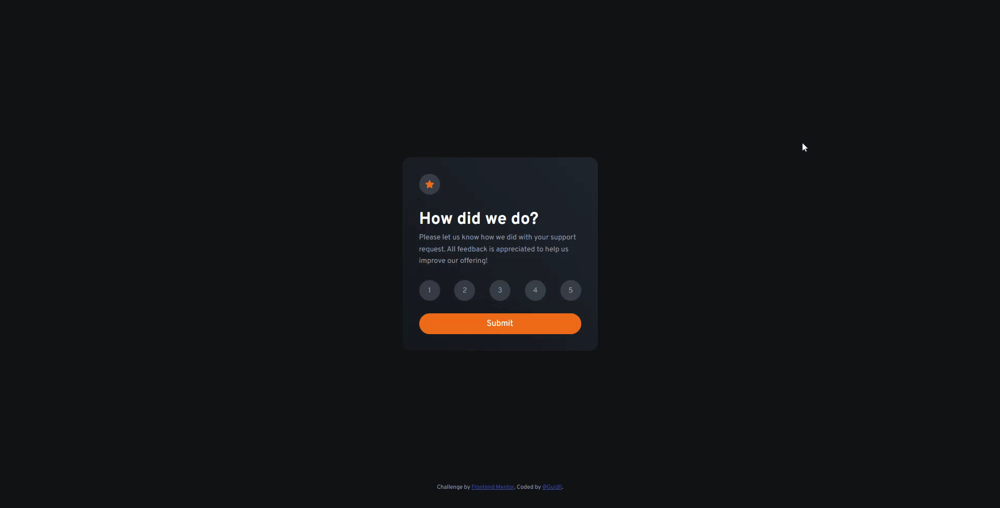

# Interactive rating component
Hello there! 👋  
In this project I code a challenge from [Frontend Mentor](https://www.frontendmentor.io/).  
An interactive component where you choose a grade, submit and after receiving visual confirmation of your review.

## How to test
**Choose which you prefer**
- Access the [deploy link](https://rainbow-mooncake-740412.netlify.app/)
- Open the `index.html` file in your browser

### Technologies and tools
- HTML
- CSS
- JS

### Overview

